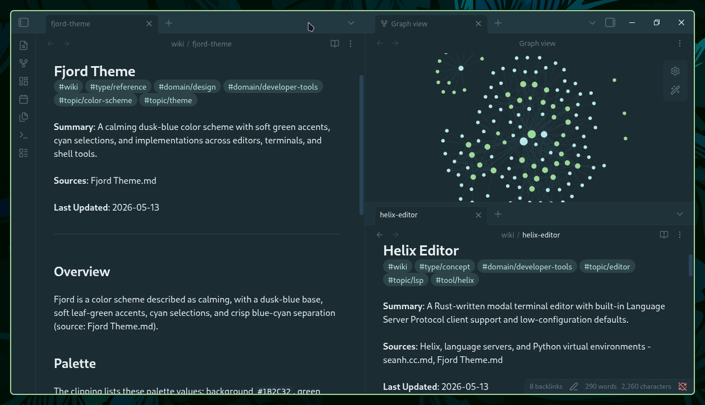

# Fjord Theme for Obsidian

A dusk-blue base with primary leaf-green accents, cyan selections, and crisp blue/cyan separation for Obsidian.




## 🎨 Color Palette

### Core Colors

| Color | Name |
| ---- | ----------------- |
|  | **background** |
|  | **backgroundAlt** |
|  | **surface** |
|  | **line** |
|  | **foreground** |
|  | **muted** |
|  | **mutedDim** |

### Accent Colors

| Color | Name |
| ---- | ---------------------------- |
|  | **green** _(primary accent)_ |
|  | **blue** |
|  | **yellow** |
|  | **purple** |
|  | **red** |
|  | **cyan** |

## 📦 Installation

### From Obsidian Marketplace

1. Open Obsidian
2. Go to **Settings → Appearance → Themes → Manage**
3. Search for **Fjord**
4. Click **Install and use**

### Manual Installation


1. Download `theme.css` and `manifest.json` from the [releases page](https://github.com/jshuntley/fjord-obsidian/releases) (or clone the repo)
2. Create the theme folder in your vault:

```bash
mkdir -p "<your-vault>/.obsidian/themes/Fjord"
```

3. Copy both files into that folder:

```
<your-vault>/.obsidian/themes/Fjord/theme.css
<your-vault>/.obsidian/themes/Fjord/manifest.json
```

4. In Obsidian, go to **Settings → Appearance**, click **Reload themes**, then select **Fjord** from the theme list


## 🔄 Updates

This theme is automatically generated from [fjord-core](https://github.com/fjord-themes/fjord-core) and deployed on every release. For an overview of all supported platforms and the full color palette, visit the [Fjord GitHub page](https://github.com/fjord-themes).
## ☕ Support My Work

If you enjoy the Fjord theme and find it useful, consider supporting my work:

[](https://buymeacoffee.com/jshuntley)
## 📄 License

MIT License - see [LICENSE](LICENSE) file for details.
## 🤝 Contributing

For theme suggestions or issues, please open an issue on the [Obsidian theme repository](https://github.com/jshuntley/fjord-obsidian/issues).